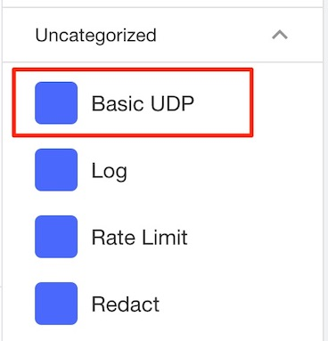

# Deploying Basic User Defined Policies using API Connect

**Pre-Requisites**
- API Connect Local Test Environment (LTE)

## Installing API Connect Local Test Environment (LTE)

Make sure you have downloaded the following files from IBM Fix Central
- IBM LTE (eg apic-lte-2018.4.1-15)
- API Designer & CLI (eg toolkit-loopback-designer-mac_lts_v2018.4.1.6-ifix3.0)

Note: The above file names will likely change during each new release

1. Install the API Connect LTE based on the instructions [here](https://www.ibm.com/support/knowledgecenter/SSMNED_2018/com.ibm.apic.toolkit.doc/rapic_lte_api_test.html)

    ```
    docker login 
    username: *******
    password: *******
    Authenticating with existing credentials...
    Login Succeeded

    apic-lte init
    ```

    Note: If you get errors during the install, you may need to stop and remove existing containers.

2. Start the API Connect LTE using the `apic-lte start` command

    ```
    $ apic-lte start
    INFO[0001] Creating docker resources                    
    INFO[0016] Waiting for services to start                
    INFO[0231] Configuring backend                          
    - Platform API url: https://localhost:2000
    - Admin user: username=admin, password=7iron-hide
    - 'localtest' org owner: username=shavon, password=7iron-hide
    - 'localtest' org sandbox test app credentials client id: 36e2da0e888ffcb6a9160200e40c5a15 , client secret: 3f4b5e8e835c4d21030a8b6436923fe8
    - Datapower API Gateway API base url: https://localhost:9444/localtest/sandbox/
    INFO[0264] Ready. The current version of the Local Test Environment is a beta release. See documentation at http://ibm.biz/localtest 
    ```
Note: If you stop the LTE (ie `apic-lte stop`), it will destroy all your containers and you will need to re-deploy your APIs. Furthermore, the sample org sandbox test app credentials will also change, so you will need to use new values when testing. You can use `apic-lte status` to view information about your environment.

## Deploy API using API Connect LTE

In this section, you will use the API Designer to deploy a set of APIs and gain familiarity with the local development environment.

1. Open the API Designer and navigate to the `openapi` folder. 
2. In the Connect to Cloud page, enter the URL `https://127.0.0.1:2000`. This endpoint is the API Manager running locally (ie Platform API url that is displayed when you start the LTE).
3. Login to the API manager using the credentials `shavon` and password `7iron-hide`.
4. Click on **Develop APIs and Products** and select `sports-api-1.0.0`.
5. Click the **Assemble** tab at the top.
    
6. Publishing APIs using LTE does not require you to explicitly define a product. You can quickly tests APIs using the default subscription which implicitly creates an API product. In the top right-hand corner, select the Offline toggle icon to publish the Sports API. Once complete the toggle will switch to **Online**.
    
7. Once the API is published, you can easily test it using any tool. For simplicity, you can use the following curl command (replacing the client id and secret with your own values)
    ```
    curl -k -X GET \
  'https://localhost:9444/localtest/sandbox/sports/teams?league=nba' \
  -H 'x-ibm-client-id: 36e2da0e888ffcb6a9160200e40c5a15' \
  -H 'x-ibm-client-secret: 3f4b5e8e835c4d21030a8b6436923fe8'
    ```

## Creating User Defined Policies (UDP)

The basic UDP allows you to package one or more API assemblies into a single policy for reusability. For example, you can create a single logging policy that consists of multiple API Assembly policies such as GatewayScript and Set-Variable.

1. Expand the `udp-basic` directory, you will notice two files:
 - udp-basic-policy.cfg
 - udp-basic-gws.js

2. Open the `udp-basic-policy.cfg` file. You will notice that it consists of DataPower CLI commands. You won't need to understand each command if you stick to the script and modify specific commands. The first command is the `Set Variable` policy which creates a set of context variables that are used in the API Assembly. The value `$(local.parameter.credential)` is a special variable that is obtained from user input during API assembly development. This is similar to any API assembly policy that asks for input (ie Public Key to validate a JSON Web Token), so this paramater should reflect a user input field that is dynamically handled at runtime.

    ```
    assembly-setvar udp-basic_1.0.0_set-variable_0
        reset
        title "set-variable"
        correlation-path "$.x-ibm-configuration.assembly.execute[0]"
        variable
            action set
            name "param1"
            type string
            value "$(local.parameter.credential)"
        exit
        variable
            action set
            name "message.headers.content-type"
            type string
            value "text/xml"
        exit
    exit
    ```

    In general, you can reuse these commands when creating a new policy. Just replace `udp-basic` with your policy name. If you have additional variables, copy/paste the variable section following the same format.
    
3. The next command is the GatewayScript policy. The `gatewayscript-location` path is important since its references a filename at the desired location. When you deploy the UDP it will place this file at the root of the gateway extension folder.
    ```
    assembly-gatewayscript udp-basic_1.0.0_gatewayscript_1
        reset
        title "gatewayscript"
        correlation-path "$.x-ibm-configuration.assembly.execute[1]"
        gatewayscript-location temporary:///filestores/extensions/gateway-extension/udp-basic/udp-basic-gws.js
    exit
    ```

4. The next set of commands build the internal DataPower configuration for the UDP. If you have multiple policies then they will be reflected in this command.
    ```
    api-rule udp-basic_1.0.0_main
        reset
        action udp-basic_1.0.0_set-variable_0
        action udp-basic_1.0.0_gatewayscript_1
    exit

    assembly udp-basic_1.0.0
        reset
        rule udp-basic_1.0.0_main
    exit
    ```

 5. This last snippet create the UDP policy, including the information that is displayed in the UI. Remember that the parameter name `credential` needs to match the last part of the variable used in the Set Variable policy ie (`$(local.parameter.credential)` )
    ```
    assembly-function "udp-basic_1.0.0"
        summary "udp-basic-policy_1.0.0"
        title "Basic UDP"
        parameter
            name "credential"
            description "Parameter name"
            value-type string
        exit
        assembly udp-basic_1.0.0
    exit
    ```

6. Optionally, you can deploy the UDP policy with the following snippet or manually add them to the DataPower configuration. In this tutorial, you will manually add the UDP since you will need to restart the API Gateway service in the same step; however for a production (managed deployment), you should include this snippet so the rollout is automated.

    ```
    apic-gw-service
        user-defined-policies udp-basic_1.0.0
    exit
    ```

7. Open the `udp-basic-gws.js` file and examine its content. The sample code shows how to access the context variable from the `Set-Variable` policy created in the `udp-basic-policy.cfg`. The Javascript code simply creates a new JSON object with the contents of the parameter and the result of the Invoke policy.
    ```
    var param1 = context.get('param1');
    console.info ("param1 %s", param1);

    if (param1 == null || param1 == '') {
        context.reject('Invalid Parameter', 'The paramater param1 you provided is invalid');
        context.message.statusCode = '401 Unauthorized';
    }

    var jsonBody = {
        "param1" : param1,
        "body" : apim.getvariable('message.body')
    }
    ```

# Packaging and Publishing UDP using Gateway Extensions

In this section, you will package the UDP policy into a Gateway extension and deploy it to the DataPower Gateway. The API Manager includes a CLI which provides the ability to perform managed deployments into the gateway cluster.

- A single Gateway extension is deployed to a Gateway cluster. Artifacts are packaged into a ZIP file containing .cfg files, together with any dependent files that are referenced from the CFG file. 
- All files must be at the root of the ZIP file. The CFG files are processed in alphanumeric order by file name.
- ZIP files are uploaded to the file system: `temporary:///filestores/extensions/gateway-extension/` so any file references must be adjusted accordingly.

1. ZIP the file so that no folders are packaged into the ZIP file. Make sure your in the root directory when you perform the command. Optionally, you can add the commands to the `zip-gw-extension.sh` file.
    ```
    zip gw-extension.zip udp-basic/*.cfg udp-basic/*.js
    ```
2. Login to API manager using the `apic` cli
    ```
    apic login --server 127.0.0.1:2000 --username admin --password 7iron-hide --realm admin/default-idp-1
    ```
3. Upload extension using the `apic` command-line tool. You will likely only need to change the `--server` parameter.
    ```
    apic gateway-extensions:create gw-extension.zip --scope org --org admin --gateway-service datapower-api-gateway --availability-zone availability-zone-default --server 127.0.0.1:2000
    
    gateway-extension   https://127.0.0.1:2000/api/orgs/53463679-3f9f-44d3-8c98-0ae242757eb1/availability-zones/09b41905-d076-425f-81a1-060369e125a0/gateway-services/ee46f2eb-3560-48af-a403-38fd804e183c/gateway-extension   
    ```
4.  Confirm extension has been added
    ```
    apic gateway-extensions:get --scope org -o admin --gateway-service datapower-api-gateway --availability-zone availability-zone-default --server 127.0.0.1:2000 --output -

    type: gateway_extension
    api_version: 2.0.0
    name: gateway-extension
    gateway_service_url: >-
    https://127.0.0.1:2000/api/orgs/53463679-3f9f-44d3-8c98-0ae242757eb1/availability-zones/09b41905-d076-425f-81a1-060369e125a0/gateway-services/ee46f2eb-3560-48af-a403-38fd804e183c
    scope: org
    created_at: '2019-08-13T22:01:11.538Z'
    updated_at: '2019-08-13T22:01:11.538Z'
    org_url: 'https://127.0.0.1:2000/api/orgs/53463679-3f9f-44d3-8c98-0ae242757eb1'
    url: >-
    https://127.0.0.1:2000/api/orgs/53463679-3f9f-44d3-8c98-0ae242757eb1/availability-zones/09b41905-d076-425f-81a1-060369e125a0/gateway-services/ee46f2eb-3560-48af-a403-38fd804e183c/gateway-extension
    ```
    
    **Important**: If you need to re-deploy then delete the gateway extension with the following command:
    ```
    apic gateway-extensions:delete --scope org --org admin --gateway-service datapower-api-gateway --availability-zone availability-zone-default --server 127.0.0.1:2000
    ```

In the next step, you will manually trigger the API Manager to send the UDP to the API Gateway.

7. Login to the DataPower UI at `https://127.0.0.1:9091` 
    - Username `admin` 
    - Password `admin`. 
    - Graphical UI drop-down: `Web GUI`
    - Domain: apiconnect

8. Trigger the API Manager to push the Gateway extension to the Gateway. Restart the API Connect Gateway service, modify the **Administrate State** to **disabled** and click **Apply**. Change the state back to **Enabled** and click **Apply**.

9. You may need to wait a minute for the Gateway Extension to copy over, when you refresh the screen, scroll down to the User-defined Policy, select the `UDP Basic` policy in the drop-down and click **add**.  Click **Apply** to save the configuration.

    

10. Switch to the API Designer and click the existing **sports-api-1.0.0** API. Click the **Assemble** tab. You should see the `UDP Basic` policy.

    

11. Drag and drop the UDP-Basic policy into the Assembly. Click the Policy and enter any credential value say `ozairs`. Save the policy.

12. Switch to the Design view and Republish the API. In the top right-hand corner beside **Running**, click the Play icon or the wheel icon to republish the API. 

13. Test the API again using curl, you should get a JSON response, with the parameter value and the JSON body

```
> curl -s -X GET \
  'https://localhost:9444/localtest/sandbox/sports/teams?league=nba' \
  -H 'x-ibm-client-id: 36e2da0e888ffcb6a9160200e40c5a15' \
  -H 'x-ibm-client-secret: 3f4b5e8e835c4d21030a8b6436923fe8'

    {
    "param1": "ozairs",
    "body": null
    }
```

    **Bonus**
    Notice that the body field is `null`. This is not a bug in the policy. The previous Invoke action returns a JSON response which the GatewayScript copies directly into a variable. The API Assembly needs to know the message type from the Invoke policy. Add a `Parse` assembly policy between the Invoke and the `UDP Basic` policy. Test again and should now see the response returned.

## Summary

In this tutorial, you learned how to deploy a User-defined policy (UDP) consisting of mutliple API Assembly policies, Set-Variable and GatewayScript. The UDP was packaged as a Gateway Extension and deployed to the API Gateway. You validated that the API designer displayed the UDP in its palette and configured as part of an API deployment.